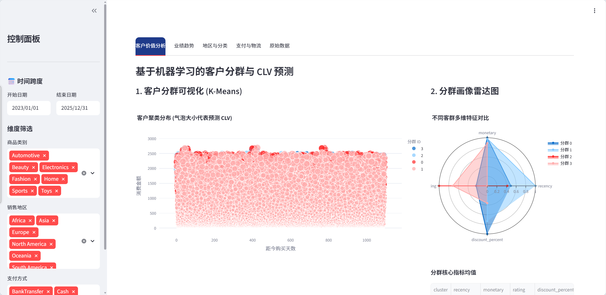
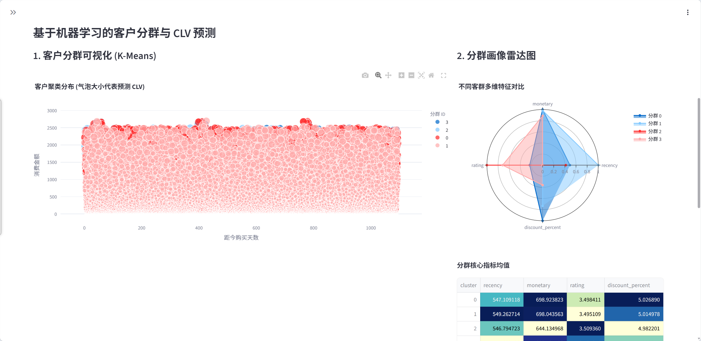
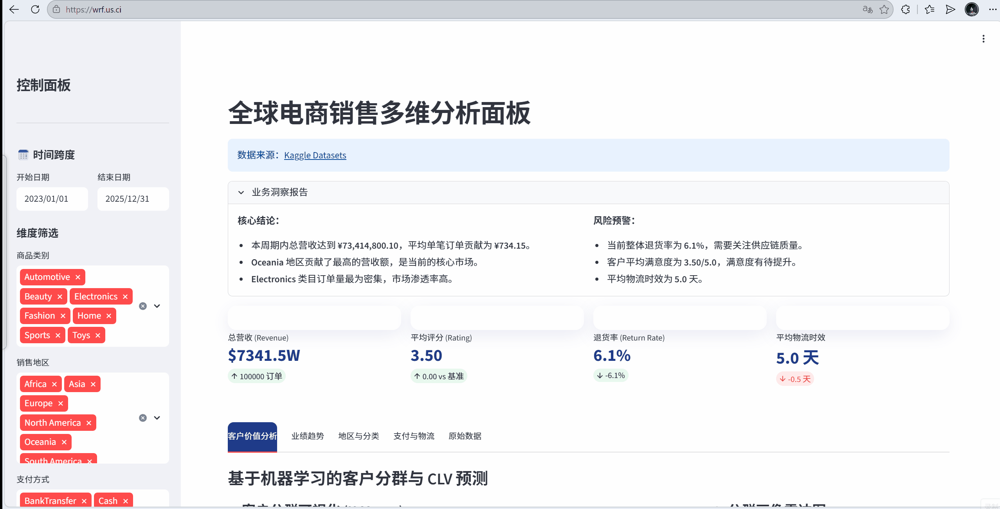

# 全球电商销售多维分析面板 (Global E-Commerce Sales Dashboard)


> *系统运行概览*

## 项目简介
本项目是一个基于 Python 和 Streamlit 开发的**全球电商销售多维数据分析与预测系统**。系统不仅仅提供基础的业务指标（KPI）监控和多维数据可视化，更深度集成了基于 `Scikit-learn` 的机器学习算法，实现了客户分群（K-Means）与客户终身价值（CLV）预测。

该工具旨在帮助电商运营和管理团队快速洞察市场趋势、识别高价值/易流失客群，并提供数据驱动的决策支持。

## 核心功能亮点

### 1.智能业务洞察与 KPI 监控
* **玻璃拟态 UI 设计**：采用现代化的 Glassmorphism 风格展示核心指标（总营收、平均评分、退货率、物流时效）。
* **动态智能摘要**：根据当前筛选条件，自动生成业务结论与风险预警。

### 2.多维度数据可视化
* **业绩走势分析**：支持日、周、月三个时间维度的营收趋势追踪。
* **地区与品类洞察**：直观展示不同地区的营收占比与各大品类的营收排行。
* **物流与支付分析**：支付方式漏斗图与各品类物流时效分布直方图，帮助优化供应链。


> *多维数据可视化分析界面*

### 3.深度客户价值分析 (机器学习)
* **K-Means 客户聚类**：基于 RFM（Recency, Frequency, Monetary）及品类偏好等特征，将客户智能划分为 4 大群体。
* **客群画像雷达图**：多维特征对比，清晰勾勒不同分群的用户画像。
* **流失预警与高净值挖掘**：利用分位数逻辑，精准提取“高价值即将流失用户”与“潜在高净值新用户”名单。


> *基于 K-Means 算法的客户分群与画像雷达图*

### 4.强大的交互式探索
* 支持时间跨度、商品类别、销售地区、支付方式的联动筛选。
* 提供底层数据实时预览与 CSV 格式一键导出功能。



## 技术栈
* **前端展示**：`Streamlit`, 自定义 CSS
* **数据处理**：`Pandas`, `NumPy`, `Datetime`
* **数据可视化**：`Plotly Express`, `Plotly Graph Objects`
* **机器学习算法**：`Scikit-learn` (StandardScaler, KMeans)
* **高级分析模块**：`Lifetimes` (BetaGeoFitter, GammaGammaFitter - 架构预留)

## 本地运行指南

1. **克隆仓库**
   ```bash
   git clone [https://github.com/yourusername/ecommerce-sales-dashboard.git](https://github.com/yourusername/ecommerce-sales-dashboard.git)
   cd ecommerce-sales-dashboard

2. **安装依赖**
   ```python
   pip install -r requirements.txt
3. **运行应用**
   ```python
   streamlit run app.py
## 项目结构
📦 ecommerce-sales-dashboard
 ┣  assets               # 存放 README 使用的图片资源
 ┣  app.py               # 主程序入口
 ┣  synthetic_ecommerce_sales_2025.csv  # 数据源文件
 ┣  requirements.txt     # 项目依赖
 ┗  README.md            # 项目说明文档
